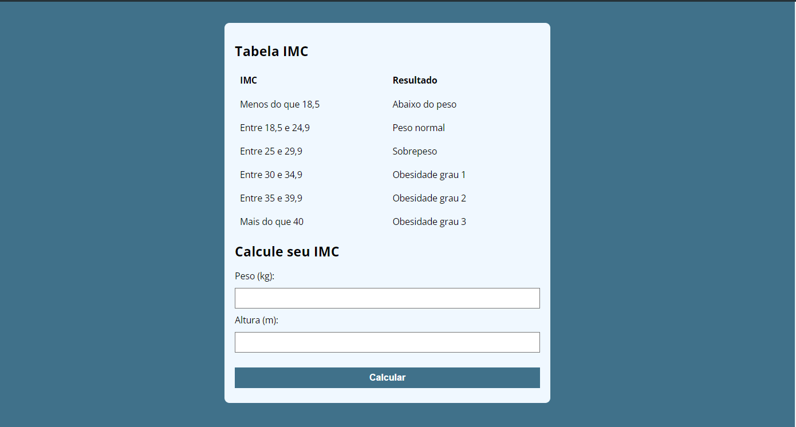
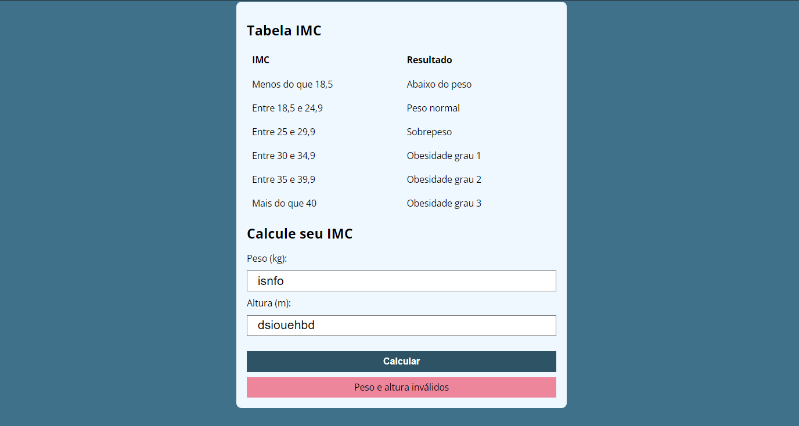
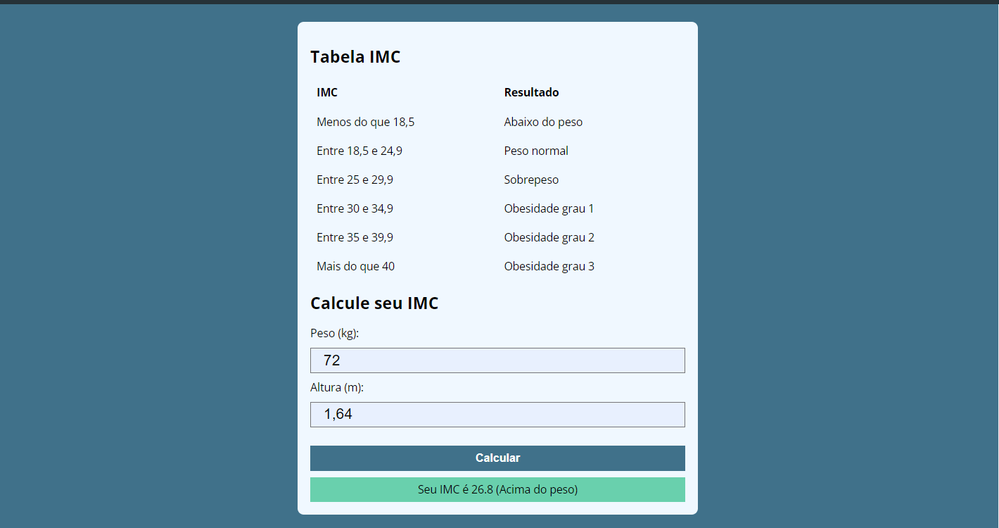

# Calculo IMC (project in pt-BR)

Esse projeto é a minha solução de um desafio proposto pelo professor [Luiz Otávio Miranda](https://beacons.ai/otaviomiranda) no curso na Udemy "" [Curso de JavaScript e TypeScript do básico ao avançado](https://www.udemy.com/course/curso-de-javascript-moderno-do-basico-ao-avancado/)

## Table of contents

- [Visão Geral](#overview)
  - [O Desafio](#o-desafio)
  - [Screenshots](#screenshots)
  - [Links](#links)
- [Meu processo](#meu-processo)
  - [O que aprendi](#o-que-aprendi)
- [Autora](#autora)

## Overview

### O Desafio

O desafio era:

- Calcular o IMC do usuário com Javascript
- Retornar o valor do IMC e o resultado de acordo com a tabela acima dos inputs
- Caso um ou mais campos do input estiverem errados, retornar uma mensagem de erro

### Screenshots





### Links

- Live Site URL: [live site](https://claraferraz.github.io/IMC)

### Meu processo

- Semantic HTML5 markup
- CSS custom properties
- CSS Grid
- CSS error e success
- JavaScript

### O que aprendi

Nesse projeto retomei conhecimentos de outros projetos como adicionar e remover classes no HTML através do JS, além disso pude colocar em prática o que tenho aprendido no curso de JS como funções e if..else. Os comentários no meu código são para fins de revisão de estudo.

```html
<div class="resultado"></div>
```

```css
.resultado {
  display: hidden;
  background-color: rgb(105, 208, 173);
  text-align: center;
  line-height: 40px;
}
.resultado.success {
  display: block;
}
.resultado.error {
  display: block;
  background-color: rgb(237, 134, 154);
}
```

```js
const setError = (message) => {
  resultado.classList.add("error");
  resultado.classList.remove("success");
  const errorDisplay = document.querySelector(".resultado.error"); //tem propriedades específicas no css

  errorDisplay.innerText = message;
};

const validateInputs = (peso, altura) => {
  const pesoNaN = Number.isNaN(peso);
  const alturaNaN = Number.isNaN(altura);
  if (pesoNaN && alturaNaN) {
    return "Peso e altura inválidos";
  } else if (pesoNaN) {
    return "Peso inválido";
  } else if (alturaNaN) {
    return "Altura inválida";
  }
  return null;
};
```

## Autora

- Website - [Clara Ferraz](https://github.com/claraferraz)
